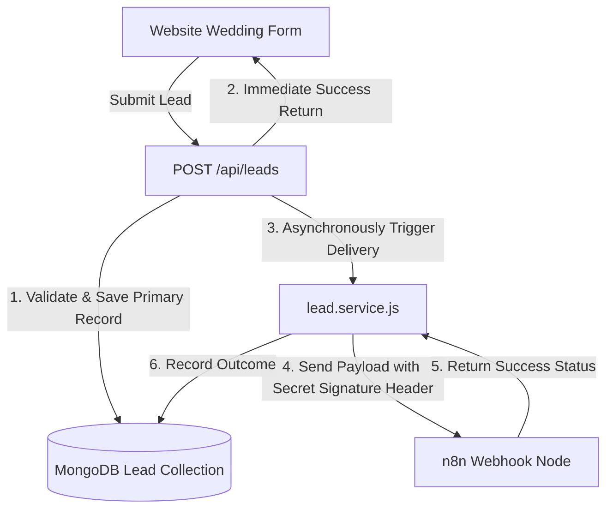

# n8n Lead Intake Integration Documentation

This document explains the backend architecture for capturing wedding leads and delivering them asynchronously to n8n.

---

## 1. Flow Architecture



---

## 2. Environment Variables

Configure these backend-only keys:

```ini
# n8n Webhook URL to deliver leads (e.g. testing or production)
N8N_LEAD_WEBHOOK_URL=http://localhost:5678/webhook-test/wedding-lead

# Shared secret key used to verify the sender (sent as X-N8N-Webhook-Secret)
N8N_WEBHOOK_SECRET=dev_n8n_secret_123
```

---

## 3. Webhook Path & Signature Verification
- **Webhook Endpoint**: `POST` `/wedding-lead` (or configured custom path).
- **Authentication**: Verification is completed by validating that the header `X-N8N-Webhook-Secret` matches the configured `N8N_WEBHOOK_SECRET`.

---

## 4. Payload Structure

The payload sent to the webhook is formatted as follows:

```json
{
  "event": "wedding_lead.created",
  "eventId": "65b4c102a0a2df332155b9a4",
  "occurredAt": "2026-08-19T08:15:30.123Z",
  "lead": {
    "id": "65b4c102a0a2df332155b9a4",
    "name": "N8N Test Lead",
    "phone": "+919876543210",
    "email": "customer@example.com",
    "weddingDate": "2026-12-25T00:00:00.000Z",
    "weddingLocation": "Chennai",
    "guestCount": 250,
    "packageInterest": "Premium",
    "requirements": "n8n integration test",
    "source": "instagram",
    "sourceMedium": "paid",
    "sourceCampaign": "phase2-test",
    "sourceContent": "ad_creative_01",
    "sourceTerm": "wedding photography"
  }
}
```

---

## 5. n8n Workflow Recommendation

The downstream n8n workflow should be structured as follows:

1. **Webhook Trigger Node**:
   - HTTP Method: `POST`
   - Response Mode: `On Received` / Respond with custom JSON (`{ "success": true, "eventId": "{{$json.eventId}}" }`).
2. **Signature Validation**:
   - Check if `X-N8N-Webhook-Secret` matches the shared secret. If not, return status code `401`.
3. **Fields Validation**:
   - Check if the incoming payload has the required fields (`event`, `eventId`, `occurredAt`, `lead.id`, `lead.name`, `lead.phone`, `lead.weddingDate`, `lead.weddingLocation`, `lead.packageInterest`).
   - Validate that `lead.packageInterest` is one of: `Standard`, `Premium`, `Elite`, or `Not Sure`.
4. **Deduplication Check**:
   - Verify `eventId` against a cache or database of processed events. If it is already processed, log a warning and return `{ "success": true, "eventId": "..." }` directly, bypassing downstream operations to prevent duplicates.
5. **Normalize & Prepare**:
   - Format phone numbers and sanitize values before queuing for subsequent nodes.

---

## 6. Outage & Timeout Failure Behavior
- If the n8n webhook is down, or responds slowly, the timeout is capped at **5 seconds**.
- The frontend client receives an immediate `201` success response, and is not affected by n8n status.
- The outcome is tracked on the Lead document's embedded `n8n` object:
  ```json
  "n8n": {
    "status": "failed",
    "sentAt": null,
    "lastAttemptAt": "2026-08-19T08:15:30.123Z",
    "attempts": 1,
    "lastError": "Webhook request timed out (5s)"
  }
  ```
