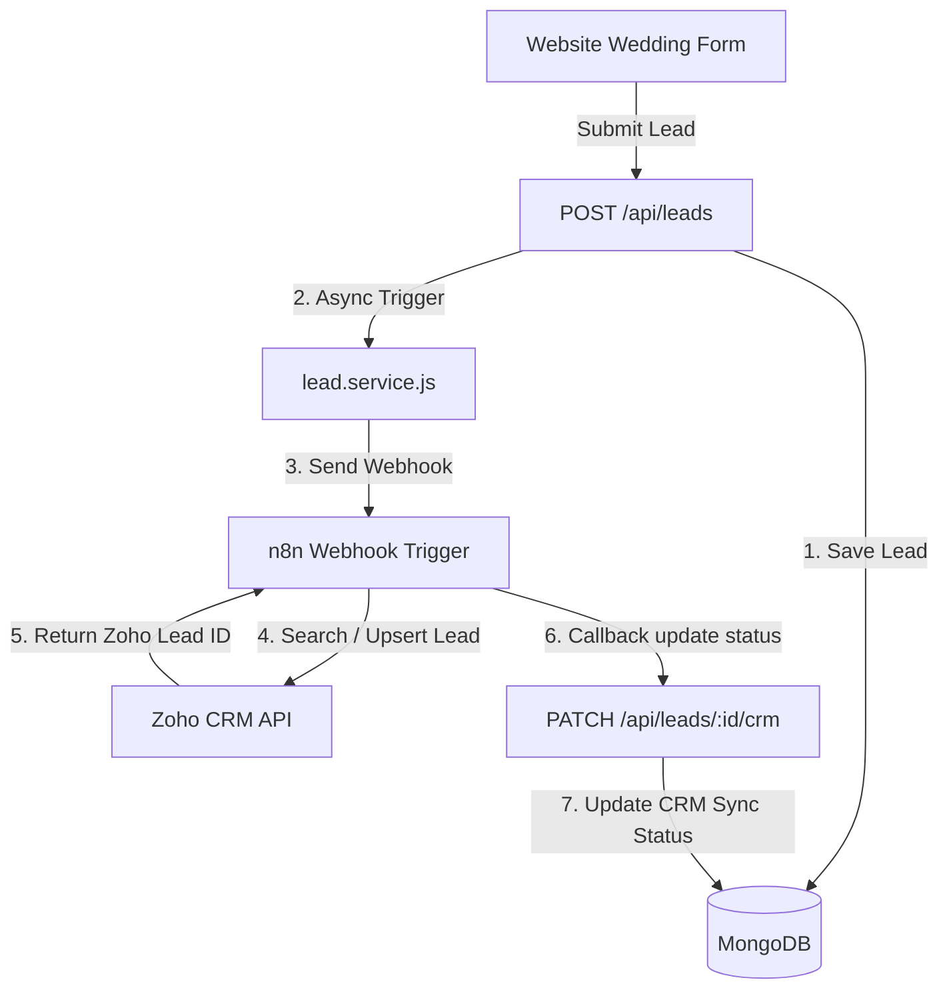

# Zoho CRM Integration Documentation via n8n

This document details the configuration required to synchronize wedding leads from the MongoDB database to the Zoho CRM Leads module using n8n.

---

## 1. Flow Architecture



---

## 2. Field Mapping Specification

The following mapping must be configured in n8n's Zoho CRM node.

| MongoDB Model Field | Zoho CRM Field Label | Zoho API Name | Data Type | Required? | Mapping / Transform Rules |
| :--- | :--- | :--- | :--- | :--- | :--- |
| `_id` | Internal Lead ID | `Internal_Lead_Id` | Text | No | Save MongoDB ID to track uniqueness |
| `name` | First Name | `First_Name` | Text | No | Parse first word: `name.split(' ')[0]` |
| `name` | Last Name | `Last_Name` | Text | **Yes** | Parse remaining words, fallback to `.` if single word |
| `phone` | Phone | `Phone` | Phone | **Yes** | Normalized format (e.g. `+919876543210`) |
| `email` | Email | `Email` | Email | No | Client email address |
| `weddingDate` | Wedding Date | `Wedding_Date` | Date | No | Format as ISO Date string `YYYY-MM-DD` |
| `weddingLocation` | Wedding Location | `Wedding_Location` | Text | No | Ceremony location |
| `guestCount` | Guest Count | `Guest_Count` | Number | No | Approximate guest attendance |
| `packageInterest` | Package Interest | `Package_Interest` | Picklist | No | Maps to Picklist: `Standard`, `Premium`, `Elite`, `Not Sure` |
| `requirements` | Description | `Description` | Textarea | No | Specific wedding notes/requirements |
| `source` | Lead Source | `Lead_Source` | Picklist | No | Maps picklist (e.g. `Website`, `Instagram`, `Facebook`) |
| `sourceCampaign` | Ad Campaign | `Ad_Campaign` | Text | No | UTM Campaign name |
| `sourceMedium` | Ad Medium | `Ad_Medium` | Text | No | UTM Medium |

> [!CAUTION]
> **Manual Zoho CRM Field Configuration Required**:
> Before running this flow in production, a custom text field **`Internal_Lead_Id`** (recommended length: 24-32 characters, marked as **Unique** to enable Upserts) must be created in the Zoho CRM Leads module layout.

---

## 3. Zoho OAuth 2.0 Configuration

To connect n8n with the Zoho CRM Leads module:
1. Register a client application at the [Zoho Developer Console](https://api-console.zoho.com).
2. Choose **Server-based Applications**.
3. Set the **Authorized Redirect URI** to your n8n OAuth redirect URL (e.g., `https://<your-n8n-instance>/rest/oauth2-credential/callback`).
4. Copy the **Client ID** and **Client Secret**.
5. Define the scopes in n8n's credentials setup:
   - `ZohoCRM.modules.leads.CREATE`
   - `ZohoCRM.modules.leads.READ`
   - `ZohoCRM.modules.leads.UPDATE`

---

## 4. n8n Workflow JSON Design
Admins can construct their n8n integration workflow with these sequential nodes:

1. **Webhook Trigger**: Receives `POST` requests.
2. **Set Variable / Normalization**: Separates name components into First Name and Last Name, formats the date.
3. **Zoho CRM Node (Search / Upsert)**:
   - Action: `Upsert`
   - Matching key field: `Internal_Lead_Id` (populated with `lead.id`).
   - If found, updates the record; if not found, inserts a new Lead.
4. **Evaluate Result**:
   - Check if the Zoho API returned success and a Zoho Lead ID.
5. **HTTP Request Node (Callback to Backend)**:
   - Method: `PATCH`
   - URL: `{{$env.BACKEND_API_URL}}/leads/{{$json.lead.id}}/crm`
   - Headers: `X-N8N-Webhook-Secret` set to `N8N_WEBHOOK_SECRET`
   - Payload:
     ```json
     {
       "status": "synced",
       "zohoLeadId": "{{$json.id}}",
       "attempts": 1
     }
     ```
6. **Error Handler Routing**:
   - If Zoho nodes throw exceptions, route output to HTTP Request Callback Node to update backend:
     ```json
     {
       "status": "failed",
       "lastError": "Zoho CRM error: {{$error.message}}",
       "attempts": 1
     }
     ```
